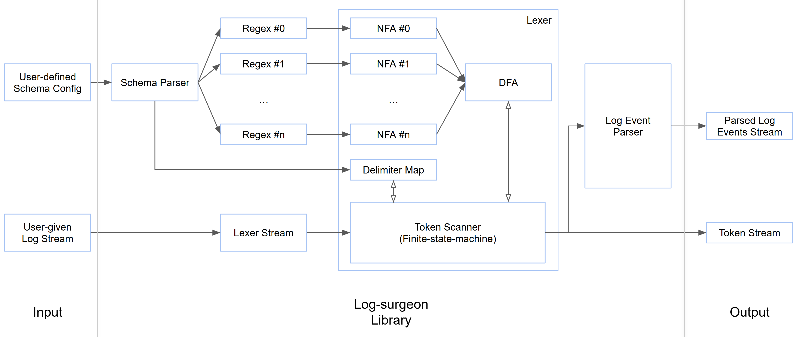

# log-surgeon: A performant log parsing library

[![Build status][badge-build-status]][project-gh-action]
![Apache Lisensed][badge-apache]

## Introduction

`log-surgeon` is a library for high-performance parsing of unstructured text logs implemented using
Rust. This project originated as the course project for
[ECE1724F1 Performant Software Systems with Rust][ece1724], offered in 2024 at the University of
Toronto.

- Project Link: [Homepage][home-page]
- Video Demo Link: [Video Demo][video-demo]
- Team Members
  - Student 1: [Siwei (Louis) He][github-siwei], 1004220960, siwei.he@mail.utoronto.ca
  - Student 2: [Zhihao Lin][github-zhihao], 1005071299, zh.lin@mail.utoronto.ca

## Motivation
Today's large technology companies generate logs the magnitude of petabytes per day as a critical
source for runtime failure diagnostics and data analytics. In a real-world production environment,
logs can be split into two categories: unstructured logs and structured logs, where unstructured
logs usually consist of a timestamp and a raw text message (i.e.,[Hadoop logs][hadoop-logs]), and
structured logs are normally JSON records (i.e., [mongoDB logs][mongodb-logs]). [CLP][github-clp],
is a distributed system designed to compress, search, and analyze large-scale log data. It provides
solutions for both unstructured and structured logs, as discussed in its
[2021's OSDI paper][clp-paper] and [2024's OSDI paper][clp-s-paper].

CLP has been deployed in many large-scale production software systems in thousands of cloud servers
and commercial electric vehicles. Throughout the deployment experiences, an interesting issue has
been found. Consider the following log event:
```text
2022-10-10 12:30:02 1563  1827 I AppControl: Removed item: AppOpItem(Op code=1, UID=1000)
```
This is an unstructured log event collected from the Android system on a mobile device. It can be
manually structured in the following way:
```JSON
{
  "timestamp": "2022-10-10 12:30:02",
  "PID": 1563,
  "TID": 1827,
  "priority": "I",
  "tag": "AppControl",
  "record": {
    "action": "Removed item",
    "op_code": 1,
    "UID": 1000
  }
}
```
Intuitively, the structured version makes it easier to query relevant data fields. For example, if
an application wants to query `UID=1000`, it can take advantage of the tree-style key-value pair
structure that JSON format provides. Otherwise, it might need a complicated regular expression to
extract the number from the raw-text log message. Unfortunately, it is impossible to deprecate
unstructured logging infrastructures in any real-world software systems for the following reasons:
- Unstructured logs are more run-time-efficient: it does not introduce overhead of structuring data.
- Legacy issues: real-world software systems use countless software components; some
  may not be compatible with structured logging infrastructure.

Hence, the high-level motivation of our project has been formed: how to improve the analyzability of
unstructured logs to make it as usable as structured logs? The scope of this problem is vast,
and we will focus on one aspect: log parsing. CLP has introduced an innovative way of handling
unstructured logs. The basic idea behind is to find the static text and variables in a raw text log
message, where the static text is like a format string. For instance, the above log event can be
interpreted as the following:
```Python
print(
  f"{timestamp}, {pid}, {tid}, {priority}, {tag}: Removed item: AppOpItem(Op code={op}, UID={uid})"
)
```
`timestamp`, `pid`, `tid`, `priority`, `tag`, `op`, and `uid` are all variables. This provides
some simple data structuring, however, it has a few limitations:
- CLP's heuristic parser cannot parse logs based on user-defined schema. For example,
  `"Removed item"` above may be a variable, but CLP's heuristic parser cannot handle that.
- CLP's heuristic parser cannot parse complicated substrings, i.e., a substring described by the
  regular expression `capture:((?<letterA>a)*)|(((?<letterC>c)|(?<letterD>d)){0,10})`.
- The parsed variables are unnamed. For example, users cannot name the 7th variable to be `"uid"` in
  the above example.

Our project, [log-surgeon-rust][home-page], is designed to improve CLP's parsing features. It is a
safe and high-performant regular expression engine specialized for unstructured logs, allowing users
to extract named variables from raw text log messages efficiently according to user-defined schema.

## Objective
The objective of this project is to fill the gap explained in the motivation above in the current
Rust ecosystem. We shall deliver a high-performance and memory-safe log parsing library using Rust.
The project should consist of the core regex engine, the parser, and the user-oriented log parsing
interface.

The core regex engine is designed for high-performance schema matching and variable extraction.
User-defined schemas will be described in regular expressions, and the underlying engine will parse
the schema regular expressions into abstract syntax trees (AST), convert ASTs into non-deterministic
finite automata ([NFA][wiki-nfa]), and merge all NFAs into one large deterministic finite automata
([DFA][wiki-dfa]). This single-DFA design will ensure the execution time is bounded by the length of
the input stream.

The actual log parser should operate similarly to a simple compiler: it uses a lexer to process the
input character stream and emits tokens according to the user-defined schema, and makes decisions
based on emitted tokens to construct parsed log events.

The log parsing interface will provide user programmatic APIs to:
- Specify inputs (variable schemas) to configure the log parser
- Feed input log stream to the log parser
- Retrieve outputs (parsed log events structured according to the user schema) from the parser

## Features  
As a log parsing library, log-surgeon provides the following features that differ from general text
parsers:
- **Advanced Log Parsing Capabilities:**
  - Extracts variable values such as log levels and user-defined variables, regardless of their
    position within log events.
  - Utilizes regular expressions tailored to each variable type rather than for entire log events.
  - Supports parsing of multi-line log events, delimited by timestamps.

- **Customizable Stream Support:**
  - Enables integration with user-defined stream types through the `log_surgeon::lexer::LexerStream`
    trait.

- **Flexible Parsing APIs:**
  - A **low-level API** for streaming lexer-generated tokens.
  - A **high-level API** that structures tokens into parsed log events for easier consumption.

Check **User's Guide** section for more details.

As the library prioritizes log parsing, the regex engine is not part of the default API. To access
regex-specific functionality, enable the `regex-engine` feature in the Cargo configuration. This
feature provides APIs for:
- Converting [regex_syntax::ast::Ast][regex-syntax-ast-Ast] into an NFA.
- Merging multiple NFAs into a single DFA.
- Simulating a DFA with character streams or strings.


## User's Guide

log-surgeon is a Rust library for high-performance parsing of unstructured text logs. It is
being shipped as a Rust crate and can be included in your Rust project by adding the following line
to your `Cargo.toml` file:
```toml
[dependencies]
log-surgeon = { git = "https://github.com/Toplogic-Inc/log-surgeon-rust", branch = "main" }
```

### Architecture Overview


### User-defined Schema Config

log-surgeon allows users to customize their own log parser using schema. For detailed instructions,
refer to the [Schema Documentation](docs/Schema.md).

### Lexer

log-surgeon provides its lexer as a low-level API, which parses log events into a stream of tokens.
Tokens can be classified into the following types:

- **Timestamp**: A token that matches a defined timestamp pattern.
- **Variable**: A token that matches a defined variable pattern.
- **StaticText**: A token that does not match any timestamp or variable pattern.
- **StaticTextWithNewline**: A variant of StaticText that ends with a newline character ('\n').

**Tips**:
- Each token holds a byte buffer as its value.
- A timestamp token includes an ID that corresponds to the regex pattern defined in the schema
config.
- A variable token includes an ID that maps to the variable name and its associated regex pattern in
the schema config.
- Each token also retains source information, indicating the line in the input from which the token 
was extracted.

The lexer also allows users to define their own **custom input type**. To integrate a custom input
log stream, it must implement the [log_surgeon::lexer::LexerStream](src/lexer/lexer_stream.rs)
trait, which consumes the stream byte by byte. By default, we provide
[log_surgeon::Lexer::BufferedFileStream](src/lexer/streams.rs) to read a log file from file system.

**Example**:

A simple example program is provided in [examples/lexer](examples/lexer/src/main.rs) to parse a
given log file and print all the tokens. You can use the following commands to run the program and
parse the sample logs:
```shell
cd examples/lexer
cargo run -- ../schema.yaml ../logs/hive-24h.log
# If you want to try some other inputs, run:
# cargo run -- <SCHEMA_FILE_PATH> <INPUT_FILE_PATH>
```

### Log Parser

log-surgeon provides a log parser as a high-level API. The log parser consumes the parsed tokens
from the underlying lexer, and constructs log events using the following parsing rules:
```
<log-event> ::= <timestamp> <msg-token-sequence> <end-of-line>

<msg-token-sequence> ::= <msg-token> <msg-token-sequence>
                   | ε  (* empty sequence *)

<msg-token> ::= <variable>
          | <static-text>

<timestamp> ::= TOKEN(Timestamp)

<variable> ::= TOKEN(Variable)

<static-text> ::= TOKEN(StaticText)
          | TOKEN(StaticText_EndOfLine)

<end-of-line> ::= TOKEN(StaticText_EndOfLine)
```
NOTE: In practice, the first log event might miss the timestamp and the last log event might miss
the end-of-line due to file/stream truncations.

**Example**:

A simple example program is provided in [examples/simple-parser](examples/simple-parser/src/main.rs)
to parse a given log file and print all the constructed log events. You can use the following
commands to run the program and parse the sample logs:
```shell
cd examples/simple-parser
cargo run -- ../schema.yaml ../logs/hive-24h.log
# If you want to try some other inputs, run:
# cargo run -- <SCHEMA_FILE_PATH> <INPUT_FILE_PATH>
```

## Experimental Results

We've tested and benchmarked both lexer and log parser APIs on real-world unstructured log dataset.
This section demonstrates our experimental results.

| Dataset                                | Total Log Size (GByte) | # Tokens   | Lexer Execution Time (real time in seconds) | Lexer Throughput (#tokens / sec) | Parser Execution Time (real time in seconds) | Parser Throughput (MByte / sec) |
|----------------------------------------|------------------------|------------|---------------------------------------------|----------------------------------|---------------------------------------------|---------------------------------|
| [hive-24hr][log-hive]                  | 1.99                   | 62334502   | 9.726                                       | 6409058.40                       | 10.125                                      | 201.08                          |
| [openstack-24hr][log-open-stack]       | 33.00                  | 878471152  | 178.398                                     | 4924220.85                       | 198.826                                     | 169.94                          |
| [hadoop-cluster1-worker1][log-hadoop] | 84.77                  | 2982800187 | 442.400                                     | 6742010.28                       | 492.523                                     | 176.25                          |

## Reproducibility Guide
There are several regression tests in the `tests` directory of the repository as well as in the
individual components of the project. You can run the tests to ensure that the library is working
as expected. The tests include testing the AST to NFA conversion, the NFA to DFA conversion, the
DFA simulation on the input stream, and the correct passing of unstructured logs given input file
and log searching schema.

To run the tests, you can use the following command:
```shell
cargo test
```

There are also example usage of the library in the `examples` directory of the repository. You can
run the examples to see how the library can be used or be reproduced in a real-world scenario. Assume
you are in the root directory of the repository, you can run the following command to change your
directory to the examples directory and run the example:
```shell
cd examples
cargo run
```
The example uses the repository relative path to include the dependency. If you want to include the
library in your project, you can follow the user's guide above where you should specify the git URL
to obtain the latest version of the library.

## Contributions by each team member
1. **[Louis][github-siwei]**
- Implemented the draft version of the AST-to-NFA conversion.
- Implemented the conversion from one or more NFAs to a single DFA.
- Implemented the simulation of the DFA on the input stream.


2. **[Zhihao][github-zhihao]**
- Implemented the final version of AST-to-NFA conversion.
- Implemented the schema parser.
- Implemented the lexer.
- Implemented the log parser.

Both members contributed to the overall architecture, unit testing, integration testing, and library
finalization. Both members reviewed the other's implementation through GitHub's Pull Request.

## Lessons learned and concluding remarks
This project provided us with an excellent opportunity to learn about the Rust programming language.
We gained hands-on experience with Rust's borrowing system, which helped us write safe and reliable
code.

While we successfully completed the project, we identified areas for improvement. First, we could
have invested more time in the research and design phase. A clearer consensus on the AST-to-NFA
conversion design could have reduced the time spent on iterations during implementation.

Second, due to time constraints, we couldn’t fully optimize the library’s performance. While the
core functionality is implemented, there’s significant room for improvement. We have many ideas for
optimization but lacked the time to execute them.

Overall, the project is a great learning experience. We have learned a lot about Rust, how to ship a
Rust crate, and how everything works behind the regular expression processing. We are proud filling
the gap in the Rust ecosystem where there is no high-performance unstructured log parsing library.

The future work:
- Improve DFA simulation performance.
- Implement [tagged-DFA][wiki-tagged-dfa] to support more powerful variable extraction.
- Optimize the lexer to emit tokens based on buffer views, reducing internal string copying.

[badge-apache]: https://img.shields.io/badge/license-APACHE-blue.svg
[badge-build-status]: https://github.com/Toplogic-Inc/log-surgeon-rust/workflows/CI/badge.svg
[clp-paper]: https://www.usenix.org/system/files/osdi21-rodrigues.pdf
[clp-s-paper]: https://www.usenix.org/system/files/osdi24-wang-rui.pdf
[ece1724]: https://www.eecg.toronto.edu/~bli/ece1724
[github-clp]: https://github.com/y-scope/clp
[github-siwei]: https://github.com/Louis-He
[github-zhihao]: https://github.com/LinZhihao-723
[hadoop-logs]: https://zenodo.org/records/7114847
[home-page]: https://github.com/Toplogic-Inc/log-surgeon-rust
[log-hadoop]: https://zenodo.org/records/7114847
[log-hive]: https://zenodo.org/records/7094921
[log-open-stack]: https://zenodo.org/records/7094972
[mongodb-logs]: https://zenodo.org/records/11075361
[project-gh-action]: https://github.com/Toplogic-Inc/log-surgeon-rust/actions
[regex-syntax-ast-Ast]: https://docs.rs/regex-syntax/latest/regex_syntax/ast/enum.Ast.html
[wiki-dfa]: https://en.wikipedia.org/wiki/Deterministic_finite_automaton
[wiki-nfa]: https://en.wikipedia.org/wiki/Nondeterministic_finite_automaton
[wiki-tagged-dfa]: https://en.wikipedia.org/wiki/Tagged_Deterministic_Finite_Automaton
[video-demo]: https://www.youtube.com/watch?v=0mJwwBKXU7A&ab_channel=SiweiHe